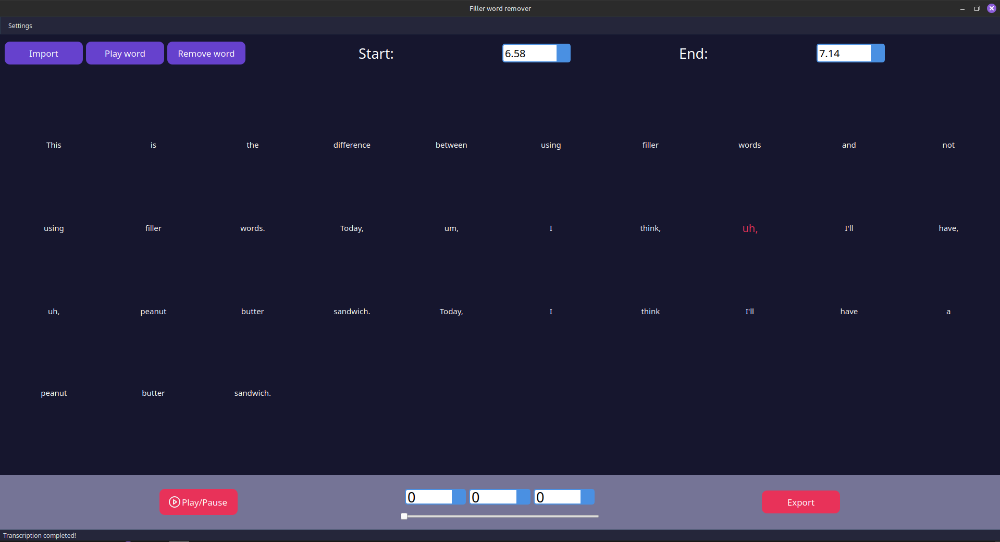

# Filler Words Remover

**Filler Words Remover** is a powerful tool that leverages OpenAI's Whisper model to help you quickly and easily remove filler words from videos. Designed to save time during editing, this tool allows you to identify and remove unnecessary words without manually navigating through your video editing software.

## Features

- Detect and highlight filler words in your video.
- Listen to individual words to verify accuracy.
- Update timestamps (start and end) for precise editing.
- Adjustable model quality and device (CPU/GPU) settings.
- Supports multiple transcription languages (default: English).

## Screenshot



## Quick Start

1. **Create a Python virtual environment**  
   ```bash
   python -m venv venv
   ```

2. **Activate the virtual environment**  
   - **Windows:** `venv\Scripts\activate`  
   - **Mac/Linux:** `source venv/bin/activate`

3. **Install dependencies**  
   ```bash
   pip install -r requirements.txt
   ```

4. **Run the app**  
   ```bash
   python app.py
   ```

## Configuration Details

- **Device & Model:** By default, the app uses the CPU with the **High** quality model. You can switch to GPU or a lower-quality model from the settings tab (top left).  
- **Language:** To change the transcription language, edit `extractor.py` on **line 16** where it says `'en'`.
